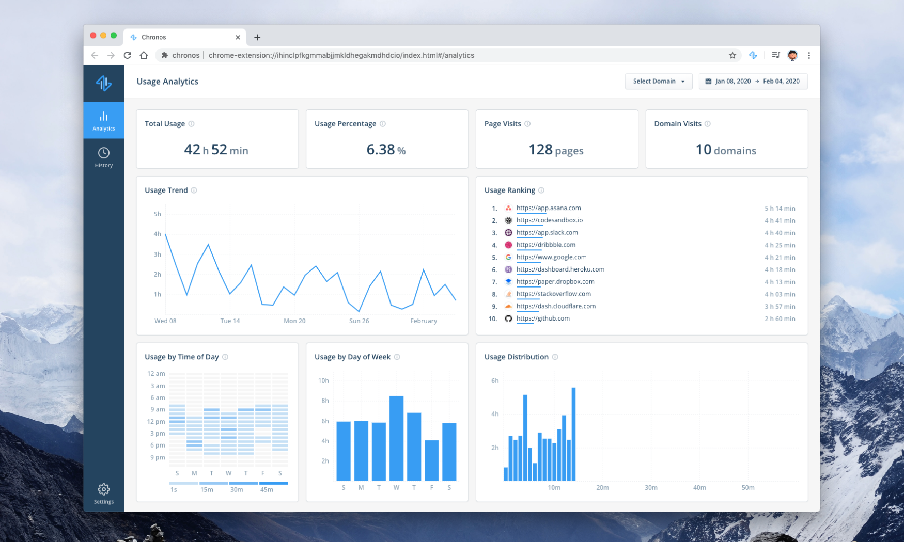

<p align="center">
  
</p>

## About

[](https://circleci.com/gh/tohjustin/chronos/tree/master)
[](https://github.com/tohjustin/chronos/releases)
[](https://opensource.org/licenses/MIT)

Chronos is a browser extension for visualizing web browsing activity.

<p align="center">
  
</p>

### FAQ

#### Do you collect any data?

__Not at all!__ All recorded web browsing activity is stored locally on your device. The application is not connected to any external services & no data will be transmitted out of your device.

#### How can I export my data?

Users have the ability to export all recorded data or import data (backed-up from a different browser or machine) via the application's settings page.

#### What browsers do you support?

[//]: # (TODO: Add links to install extension for each browser platform)
Here's the list of browsers that are currently supported:

* Brave
* Chrome
* Firefox
* Opera
* Edge Chromium (coming soon)

## Getting Started

### Overview

The application consists of two main components:

* __Background Page__: Script (a.k.a `ActivityLogger`) that runs in the background & listens to browser events to record web browsing activity into the browser's client-side storage: [IndexedDB](https://developer.mozilla.org/en-US/docs/Web/API/IndexedDB_API).
* __Extension Page__: React application that retrieves & visualizes web browsing activity data stored in [IndexedDB](https://developer.mozilla.org/en-US/docs/Web/API/IndexedDB_API)

### Development Workflow

The recommended way to develop the application is to temporarily install the extension into your browser with the following steps:

1. Start the application's `webpack-dev-server` (ignore the page served on [http://localhost:3000](http://localhost:3000)):

    ```bash
    yarn start
    ```

2. Go to the browser's extension management page:

    * __Brave__: [brave://extensions](brave://extensions)
    * __Chrome__: [chrome://extensions](chrome://extensions)
    * __Firefox__: [about:debugging#/runtime/this-firefox](about:debugging#/runtime/this-firefox)
    * __Opera__: [opera://extensions](opera://extensions)

3. Temporarily install the extension (requires "Developer mode" to be enabled):

    * __Brave__/__Chrome__/__Opera__: Click on the _"Load Unpacked"_ button located at the top of the page
    * __Firefox__: Click on the _"Load Temporary Add-on..."_ button located at the top of the page

4. Once installed successfully, you should see the `chronos`'s icon in your browser's navbar. Click on it to navigate to `chronos`'s extension page.

5. You can start modifying the codebase & observe the changes right away without having to reinstall the extension. (i.e. hot-reloading should work out of the box)

#### Debugging the background page

1. Go to the browser's extension management page

2. Open the DevTools panel of the extension's background page:

    * __Brave__/__Chrome__/__Opera__: Click on _"index.html"_ link located on the extension's details card
    * __Firefox__: Click on _"Inspect"_ button located on the extension's details card

#### Debugging the extension page

To get development tools such as [react-devtools](https://github.com/facebook/react/tree/master/packages/react-devtools) & [redux-devtools](https://github.com/reduxjs/redux-devtools) to work against a temporarily installed extension, start the application's `webpack-dev-server` in remote debug mode:

```bash
yarn start:remote-debug
```

##### React DevTools

1. Start `react-devtools` server on `http://localhost:8097` (you should observe the `react-devtools` UI being opened in a new window)

    ```bash
    yarn react-devtools
    ```

2. Reload the extension page, the application should automatically connect to the `react-devtools` server & UI.

##### Redux DevTools

1. Start `redux-devtools` server on `http://localhost:8098`

    ```bash
    yarn redux-devtools
    ```

2. Open the Remote `redux-devtools` UI by clicking on the `redux-devtools` extension icon in your browser window & selecting the _"Open Remote DevTools"_ option on the dropdown

3. If this is your first time using the tool, go to the `redux-devtools` UI settings & ensure that:
    * _"Use custom (local) server"_ is checked
    * _"Host name"_ & _"Port"_ field is set to `locahost` & `8098` respectively
    * _"Use secure connection"_ option is unchecked

4. Reload the extension page, the application should automatically connect to the `redux-devtools` server & UI.

### Linting & Testing

Lint the entire codebase

```shell
yarn lint
```

Run the TypeScript compiler

```shell
yarn tsc
```

Run all unit tests

```shell
yarn test
```

Run all unit tests & enable [Node Debugger](https://nodejs.org/docs/latest-v12.x/api/debugger.html)

```shell
yarn test:debug
```

Run all unit tests & watch for changes

```shell
yarn test:watch
```

### Packaging

Build the extension & output bundle into `/build`

```shell
yarn build
```

## License

Chronos is [MIT licensed](./LICENSE).
